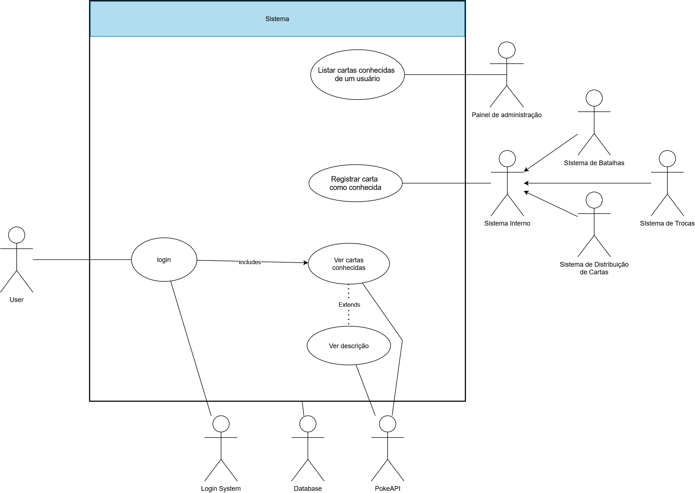

Vídeo de apresentação (padrões arquiteturais): https://drive.google.com/file/d/1PBBhoqN1TEsK9t7_FLIzdeZEXf0DXovM/view?usp=sharing

Link da pagina de documentação: https://www.notion.so/Projeto-Pok-dex-Gest-o-de-Cartas-de-Jogador-25c8e770f6a980eab8e7f792d3f06349?source=copy_link

# pokedex-cartas-conhecidas
Pokedex - Responsável por gerenciar as cartas conhecidas por cada jogador.

## Descrição

> 9) Pokédex
> Responsável por gerenciar as cartas conhecidas por cada jogador. A aplicação deve mostrar, por meio de uma interface gráfica, quantas cartas existem e quantas o jogador já conheceu (já teve em seu baralho). Mesmo que um jogador trocar uma carta, as informações da carta trocada continuam disponíveis na lista

## Diagramas

## Equipe
- Natália Jorge
- Vinicius Pereira
- Warley
- Yam Sol
